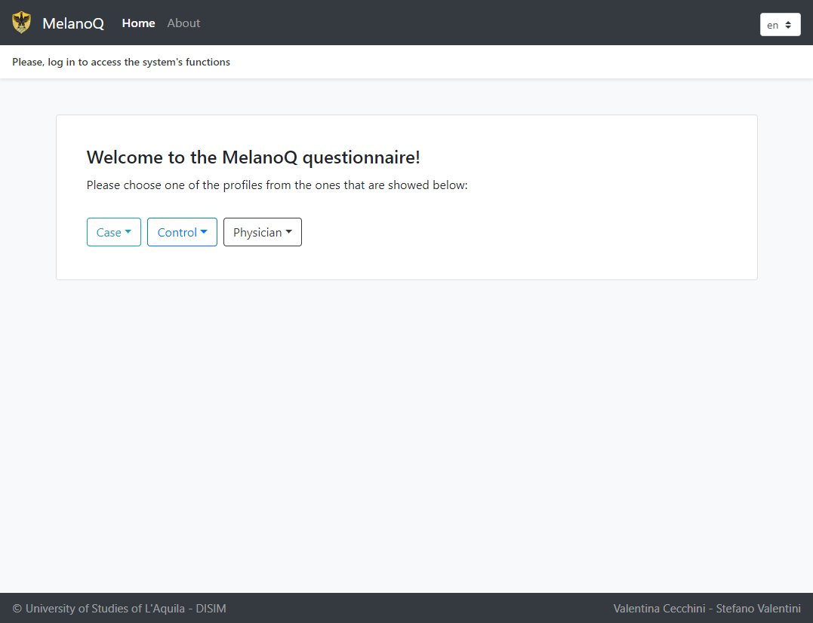
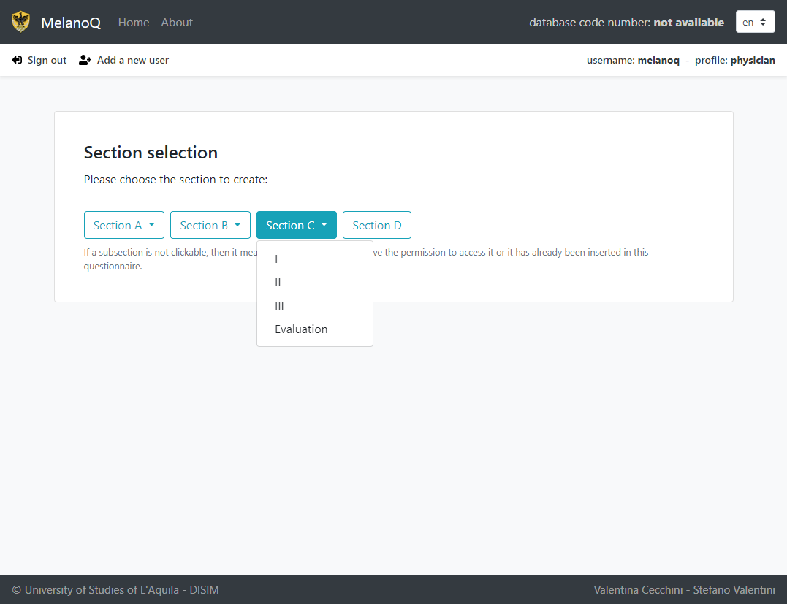

[//]: # (================================= CLIENT SECTION START ================================================)

# Web Client

The **web client** has been implemented using the [VueJS](https://vuejs.org/) framework.  
The internal project structure is as follows:
- **assets**: contains the static resources, such has the stylesheets, images, etc.
- **common**: contains the services that are accessed by rest of the application, including the api services for the connection to the api server,  the locale serviec that allows to switch between the various languages, the authentication service that is used to store the token and the logged user's data on the browser's local storage (so to survive to page refreshes and between sessions), etc.
- **components**: here are contained the components used by VueJS to build the various views, these components can be either used as singletons (i.e., they appear at most one time in a given view, these components are prefixed by the `The` keyword, such as the Header component), or classic components that can be used as many times as required in a given view (such as the Message component)).
- **locales**: contains the `.json` files that store the translation data (the key of an entry of these files points to a word/phrase to be translated, the value of that key contain the respective translation).
- **plugins**: here are located the VueJS plugins (*datepicker*, *bootstrap*, *vuelidate*, etc.).
- **router**: since VueJS implements the *single page web application* design pattern, there is the need to have a structured way to navigate between the views, this is achieved by the *router* plugin, this directory contains its configuration: a series of paths pointing to the respective view files.
- **store**: to survive between views data needs to be stored in some way, this directory contains the services that are responsible of implementing the VueJS *vuex* store interface. In these files there is a *model* description of the data, several *action* methods and several *mutation* methods; *actions* expose asynchronous entry points to *mutation*, *mutation* modify the data contained in the model (the cycle is the following: a component invokes an *action*, the *action* triggers a *mutation*, the *mutation* modifies the *model* data, the component sees the modified data; all of this while the component is free to perform other actions, since the call to the action is asynchronous).
- **views**: this directory contains the VueJS views; a *view* is a collection of components plus some stand-alone template code, the template is followed by the logic of the view (what happens when the user presses a certain button, etc.).
- **App.js**: is the entry point of the application and the first view.
- **main.js**: is the glue that connects al the various components, views, plugins, etc.

## Views
*All the screenshots that are showed here can be found inside the <code>/docs/views/</code> directory.*

### Home
This is the view that is presented to the user at the first access: here the system prompts the user to log in to access the functionnalities.
The user can log in with its credientals using three different *profiles*, the credentials are the same but the choosen profile will influnce the functionnality to which the user can access during its session: if a physician needs to have a patient (maybe a control one) to fill a questionnaire section then it can log in with its physician credentials but with the *control* profile.

After having logged in, a series of actions become available, based on the choosen profile (case/control profiles cannot access to the query engine and database code number retival).

|    Home view as guest     |  Home view: log in   |
| :-----------------------: | :------------------: |
|  |  |

|    Home view as logged user     |
| :-----------------------: |
|  |
 

### Submnitting a section
Based on which section has already been inserted and on which profile the user is currently logged in a series of section will be available.

After having choosen a section, the user will be redirected to the respective form (if, for any reason, a user with an invalid profile reaches a restricted access form section, it is automatically redirected to the home page with an error message).  
Each form section has a validator function for each field, so to avoid the insertion of invalid data.  
Once the form has been submitted the user can follow the top-right corner arrow to reach the next section to fill, if authorized.

|        Section selection         |    Section form example     |
| :------------------------------: | :-------------------------: |
|  |  |

To access a section sumbission form it is needed that the questionnaire database code number of the questionnaire that the user is trying to fill is stored in the session (with an exception for the section A1, that is the one that creates the database code number); this can happen in two ways:
- either the subsequent forms are submitted in the same session as the section A1 (the database code number is stored after having submitted a new A1 section)
- or the user has to either manually write the database code number or it can choose it from the list of the questionnaires whose section A1 has already been submitted.
 

|         Database code number retival         | 
| :------------------------------------------: | 
|  |

### Query builder

After having successfully logged in with the physician profile, it is possible to access the query builder view: here the user can create its query by composing a series of *rules*; all the added rules can be considered as *any of them must be valid* or *all of them must be valid*. It is possible to add one or more rules for each one of the fields of the questionnaire.

The following operators are available for the **textual** fields (all *case insensitive*):
- <code>contains</code>: *true* if the field contains the submitted value inside it
- <code>does not contain</code>: when *contains* is not *true*
- <code>equals</code>: *true* when the submitted value is *exactly* the same as the value contained in the field
- <code>does not equal</code>: when *equals* is not *true*

The following operators are available for the **numeric** fields:
- **<code>=</code>** (equals)
- **<code><></code>** (does not equal)
- **<code>></code>** (greather than)
- **<code>>=</code>** (greather or equal than)
- **<code><</code>** (lesser than)
- **<code><=</code>** (lesser or equal than)

Once the query has been submitted it is possible to see the results in the table at the bottom of the page. It is also possible to see the resulting questionnaires direcly in the same page as the query builder or to open them in a new page.

|      Query builder and local view       |               Standalone view                |
| :-------------------------------------: | :------------------------------------------: |
|  |  |

[//]: # (================================= CLIENT SECTION END ================================================)
